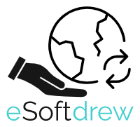

# Internship project - eSoftdrew

## 📱 Overview
eSoftDrew is an all-in-one Android application developed during an internship program.  
The app combines multiple utility modules in a single mobile platform.

## 🚀 Features
+ User authentication (Login & Sign in)
+ Calculator
+ Chat room
+ Calendar
+ TO-DO list
+ Camera
+ Alarm

## 💻👦 My contribution
+ Came up with app name
+ Designing the application logo
+ Login and sign in screen
  + Portrait orientation
  + Landscape orientation
 
## 🛠️ Tech Stack
- Java
- Android Studio
- XML layouts

## 🧩 IDE
Android Studio
